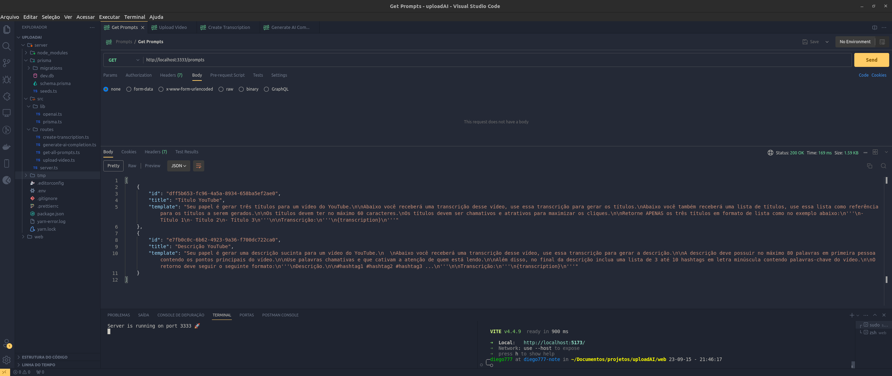
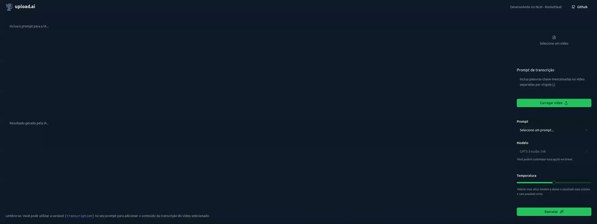

<h1 align="center">
    
</h1>
<h1 align="center">Next Level Week - AI</h1>
<p align="center">Project <strong>upload.ai</strong> developed during the Rocketseat Next Level Week.
    This application consists of converting an mp4 video to mp3 and then transcribing the file with the OpenAI API to generate a title or description of the video for YouTube, using artificial intelligence.
</p>

## Technologies
- [NodeJS](https://nodejs.org/)
- [TypeScript](https://www.typescriptlang.org/)
- [Fastify](https://www.fastify.io/)
- [Prisma](https://www.prisma.io/)
- [SQLite](https://www.sqlite.org/index.html)
- [OpenAiAPI](https://platform.openai.com/)
- [Vite](https://vitejs.dev/)
- [TailwindCSS](https://tailwindcss.com/)
- [FFMPEG](https://ffmpeg.org/)
- [RadixUI](https://www.radix-ui.com/)
- [ShadcnUI](https://ui.shadcn.com/)

## Instalation
To install the dependencies and to execute the **Backend**, clone the project on your computer an execute:
```bash
# Enter on backend directory
$ cd server

# Install dependencies
$ yarn

# Enter the environment variables in .env file
GITHUB_CLIENT_ID=""
GITHUB_CLIENT_SECRET=""

# Run Migrates
$ npx prisma migrate dev

# Start server
$ yarn run dev

# running on port 3333
```

## Backend

</img>

## Frontend

To run the React's Frontend use:
```bash
# Enter on frontend directory
$ cd web

# Install dependencies
$ yarn

# You must get your clientid from your github profile and put it in the ".env.local" file like this:
NEXT_PUBLIC_GITHUB_CLIENT_ID=

# Run
$ yarn run dev
```
</img>

## Licence

[MIT](./LICENSE) &copy; [Rocketseat](https://rocketseat.com.br/)

Made with ♥ by Diego Andrade :wave: [Get in touch!](https://www.linkedin.com/in/diego-r-andrade/)

